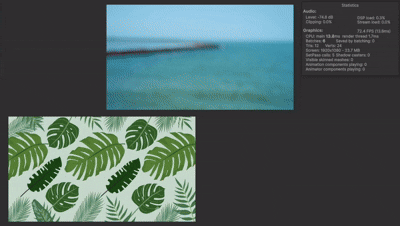

# Sentis-RobustVideoMatting-Unity

A Unity implementation of Robust Video Matting using Unity Sentis to run ONNX models. This project was created because there were no existing examples of running RobustVideoMatting ONNX models in Unity.

## Demo

## Features

- Real-time video matting with Unity Sentis
- Support for both MobileNetV3 and ResNet50 models
- GPU-accelerated inference
- Easy integration with VideoPlayer component

## Webcam Support

The same approach can be used for webcam input by replacing the VideoPlayer with WebCamTexture and converting it to RenderTexture.

## Performance

Tested on **Mac Mini M4 Pro (24GB RAM)**
- Unity Version: 6000.0.37f1
- Sentis Version: 2.1.3

| Model | Performance |
|-------|-------------|
| rvm_mobilenetv3_fp32.onnx | 60-70 FPS |
| rvm_resnet50_fp32.onnx | 30-40 FPS |

## Setup

1. Download ONNX models from the [official RobustVideoMatting repository](https://github.com/PeterL1n/RobustVideoMatting)
2. Place the downloaded model file in your Unity project
3. Assign the model to the `ModelAsset` field in `VideoMatting.cs`
4. Configure your video input and run the scene

## Model Downloads

Get the ONNX models from:
- [rvm_mobilenetv3_fp32.onnx](https://github.com/PeterL1n/RobustVideoMatting/releases/download/v1.0.0/rvm_mobilenetv3_fp32.onnx)
- [rvm_mobilenetv3_fp16.onnx](https://github.com/PeterL1n/RobustVideoMatting/releases/download/v1.0.0/rvm_mobilenetv3_fp16.onnx)
- [rvm_resnet50_fp32.onnx](https://github.com/PeterL1n/RobustVideoMatting/releases/download/v1.0.0/rvm_resnet50_fp32.onnx)
- [rvm_resnet50_fp16.onnx](https://github.com/PeterL1n/RobustVideoMatting/releases/download/v1.0.0/rvm_resnet50_fp16.onnx)

## License

This project follows the same license as the original RobustVideoMatting project.
